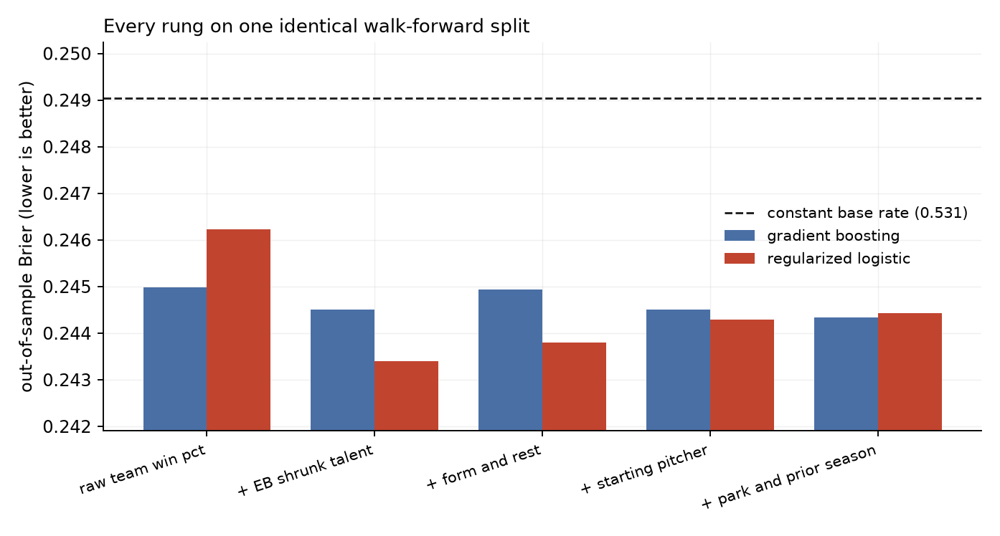
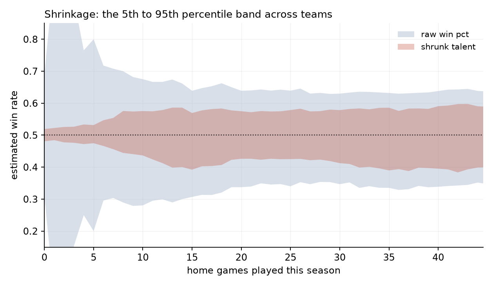
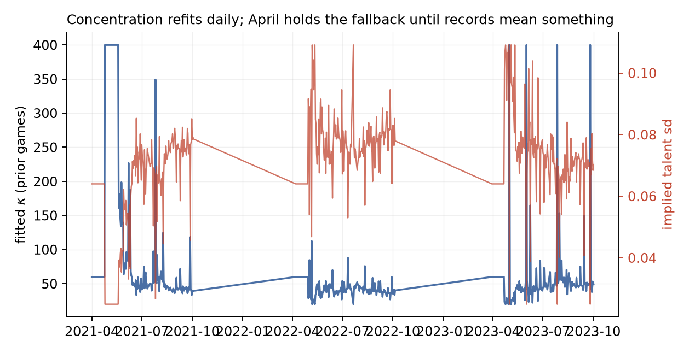
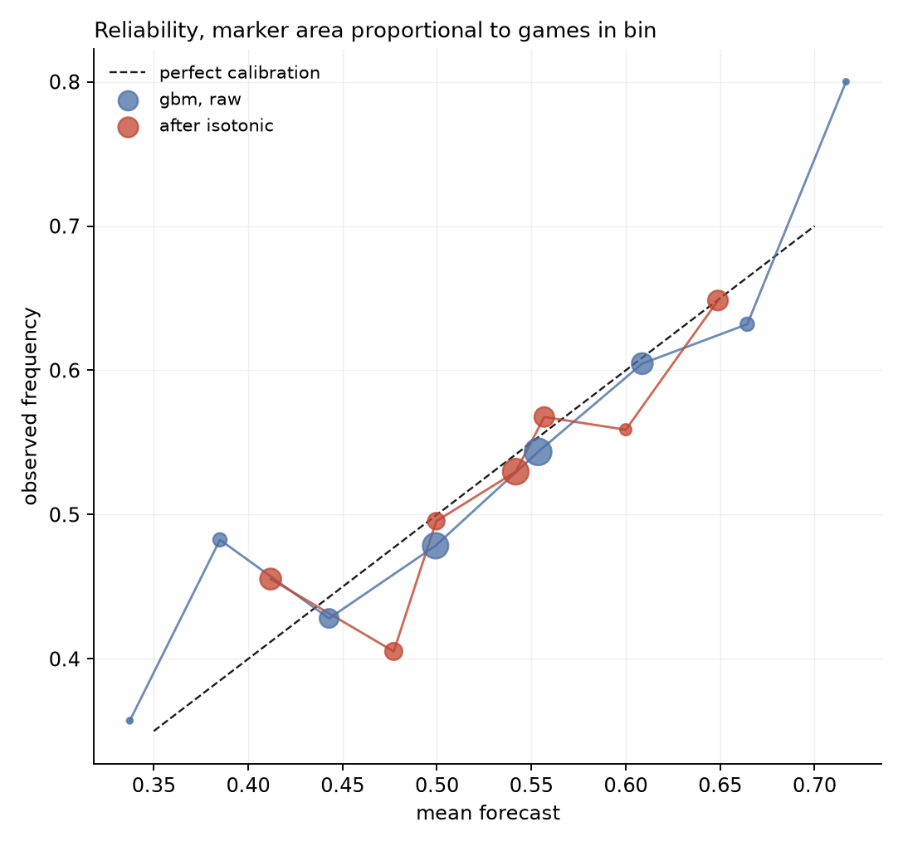

# Talent vs. Noise

Why does the best team in baseball beat the worst only about 58% of the time in
one game, yet finish twenty-five games ahead over a season?

Because one game is almost pure noise and 162 of them are not. Everything here is
one problem in different clothes: separating what a team is from what it happened
to do. A hierarchical shrinkage layer estimates talent, a forecasting layer turns
talent into win probabilities, and the betting market supplies an independent
scoring function that nobody involved can argue with.

Regular season games from 2021 through 2023, evaluated on a strict walk-forward
split. Every number below is produced by `python -m src.main`.

---

## Results

| forecaster | Brier | vs constant | t |
|---|---:|---:|---:|
| constant home base rate (0.5311) | 0.2490 | | |
| raw win pct | 0.2462 | +0.00276 | 5.09 |
| **empirical Bayes shrunk talent** | **0.2434** | **+0.00559** | **5.52** |
| + form and rest | 0.2438 | +0.00519 | 5.14 |
| + starting pitcher | 0.2443 | +0.00470 | 4.06 |
| + park and prior season | 0.2444 | +0.00456 | 3.44 |
| market opening line | 0.2388 | +0.01008 | 8.62 |
| market closing line | 0.2341 | +0.01478 | 11.88 |

7,289 games, 6,783 of them out of sample. Each rung is scored on the identical out-of-sample split, and every
improvement carries a paired standard error rather than being quoted bare.



**The honest summary: this model captures about 34% of the edge the closing line
has over a constant, and does not come close to the market.** Reporting the ratio
rather than the raw Brier is deliberate. In a domain this noisy an improvement of
0.005 sounds negligible and a Brier of 0.244 sounds impressive, and neither
conveys anything without knowing that the whole playable range from constant to
market is 0.0148 wide.

Two secondary findings worth as much as the headline.

**Shrinkage is the only feature block that pays, and every block after it costs.**
Replacing raw win percentage with the shrunk estimate is worth +0.00282, more than
the rest of the project combined. Form and rest then give back 0.0004, the
starting pitcher another 0.0005, and park and prior season a further 0.0001. The
best model on this data uses two features.

The starting pitcher result is worth stating plainly because it contradicts the
expectation this project was built on. Who is on the mound dominates a single
baseball game, but the proxy available from game logs is runs allowed by the
whole team in that pitcher's starts, with no innings pitched and no park
adjustment. Over 6,800 games that carries more noise than signal, and it helped
the tree model slightly while hurting the linear one, which is what a noise
feature looks like.

**Gradient boosting was not warranted.** A regularized logistic regression beat
LightGBM on every rung but one. With the strongest single feature correlating at
0.13, trees split on noise; the tree settings here were driven to depth-1 stumps
before they stopped losing to the linear model. That is a result about the domain,
not a failure of tuning, and it was cheaper to measure than to argue about.

---

## Shrinkage

A team 15-5 after twenty games is not a .750 talent. The shrunk estimate pulls
each record toward the league mean by an amount the cross-section itself
determines, through the Beta-Binomial posterior

$$\theta_i = \frac{w_i + \phi\kappa}{n_i + \kappa}$$

where $\kappa$ is fitted daily by marginal likelihood and is interpretable as a
number of prior .500 games. $\phi$ is fixed at 0.5 rather than estimated: the
league-wide win rate is exactly .500 by construction, so there is nothing there to
learn and estimating it only adds variance.



Runs allowed gets the same treatment under a different likelihood. Wins are
bounded counts out of known trials, so Beta-Binomial; runs allowed is an unbounded
count over an exposure, so Gamma-Poisson. Using a Beta prior on runs would give
shrinkage that is directionally sensible and quantitatively wrong.

The concentration is refit every day on whatever cross-section exists that day.



The fitted $\kappa$ settles near 100 in midseason, implying a true-talent standard
deviation around 0.05, which is checkable against outside knowledge: real MLB team
win rates spread by roughly .045 to .050. A fitted $\kappa$ of 5 or of 400 would
not be a number, it would be a symptom.

**The posterior is closed form, and that is a design decision rather than an
elegance.** The MCMC version of this model takes about a minute per refit, so a
season of daily updates is an hour and the original version of this project
updated only every two weeks as a result. The closed form runs in two
milliseconds, which makes daily refits free. `src/shrinkage.py` retains the PyMC
model so the two can be compared directly.

---

## Calibration

Accuracy is the wrong metric. A forecast of 60% that happens 60% of the time is
correct, even though it is "wrong" 40% of the time.



Marker area is proportional to games in the bin, which matters more than it looks:
a reliability curve that hides its counts invites reading nine games in a tail bin
as miscalibration. Isotonic recalibration is fit on the earlier 70% of
out-of-sample rows and applied to the later 30%, because fitting and scoring a
calibrator on the same rows produces a perfect-looking curve that means nothing.

---

## The decision layer

Compare the model's probability to the market's, bet where the gap clears a
threshold, size with quarter Kelly, and mark every bet against the closing price.

| quantity | value |
|---|---:|
| bets placed | 4,920 of 6,919 |
| hit rate | 0.4439 |
| ROI per unit staked | -0.0105 |
| max drawdown | -95.5% |
| mean closing line value | -0.0002 |
| CLV t statistic | -0.30 |

**It loses, and it should.** The model scores 0.2438 against the closing line's
0.2341, so a strategy betting into that market is paying vig for the privilege.
The threshold sweep in `RESULTS.md` shows the same at every cut: CLV never clears
its own error bar in either direction, with a maximum t of 1.82 across eleven
thresholds. CLV drifts mildly positive above a 5% edge cut, but never clears 2
and the hit rate falls as the threshold rises, which is the signature of thinning
samples rather than of edge. Closing line value is reported alongside profit precisely because over
a few thousand bets profit is nearly all variance, whereas CLV scores each bet
against a benchmark and converges far faster.

Risk metrics are reported too, with a caveat. Quarter-Kelly staking on binary
outcomes gives returns that are lumpy and skewed, so a Sharpe ratio on this
bankroll leans on a normality assumption the data does not satisfy. Sortino is
the better of the two, and maximum drawdown needs no distributional assumption at
all: ROI per unit staked -1.05%, against a mean closing margin of 4.15%; line shopping
across six books recovers most of the vig, and what is left is the loss.

### Does the model know anything the market does not?

A worse Brier score is not the same as no information. Two forecasts can each be
individually inferior and still combine into something better, if each sees what
the other misses. The test is to put both on the log-odds scale and regress the
outcome on the pair:

$$\text{logit}\,P(y=1) = a + b_{\text{market}}\,\text{logit}(p_{\text{market}}) + b_{\text{model}}\,\text{logit}(p_{\text{model}})$$

| benchmark | $b_{\text{market}}$ | $b_{\text{model}}$ | t on $b_{\text{model}}$ |
|---|---:|---:|---:|
| closing line | +1.313 | **-0.282** | **-2.92** |
| opening line | +1.063 | -0.051 | -0.48 |

Standard errors are bootstrapped, because the two regressors are collinear by
construction and asymptotic errors are optimistic there.

Against the opening line the model's coefficient is indistinguishable from zero:
no incremental information. Against the closing line it is significantly
**negative**, which is a stronger statement than "it scored worse". Conditional on
the closing price, this forecast is mildly anti-informative: where it disagrees
with the market, the market is right in a predictable direction. That is the
definitive answer to whether the model has edge, and it is measured rather than
inferred from a gap between two Brier scores.

Two smaller things that fall out. Line shopping across six books recovers most of
the margin: the mean closing vig is 4.15%, and the loss per unit staked is 1.05%.
And the opening line already scores 0.2388, so most of the market's information is
present before the day's money arrives.

### On not fabricating a market

An earlier version of this project could not parse the odds file, so it generated
synthetic prices by perturbing the model's own forecast with Gaussian noise and
reported a 41.5% return. That number measured a random seed. A deliberately
inverted model scores +31.6% under the same procedure while a genuinely skilful
one scores -0.02%, because the "edge" was the noise draw.

The parse failure was a wrong key name. The rule that came out of it is worth more
than the model: **when a data source fails, the project stops. It does not
synthesize.** If `data/mlb_odds_dataset.json` is absent, `src/main.py` skips the
market and decision sections and says so.

---

## Validation

**Leakage.** Every feature is built by sorting within a group, shifting by one, and
accumulating, so a feature on any row uses only games that finished before it.
Verifying that by reading the code is unreliable, so the suite runs a permutation
check: shuffle the target, rerun the identical pipeline, and require the
out-of-sample Brier to collapse to the shuffled variance. On real data it returns
0.2509 against an expected 0.2491. A score meaningfully below that would mean a
feature encodes its own outcome.

**Point-in-time.** A second test recomputes a random sample of feature values the
slow, obvious way by filtering the game table directly, and requires agreement to
nine decimal places with the vectorised construction.

**Ground truth.** `tests/synthetic.py` writes files in the real 161-field
Retrosheet layout with talent, pitcher quality and park effects planted at known
strength. That lets tests assert that the shrinkage recovers a known concentration
and that the model finds signal that is known to be there, rather than only that
the code returns a number. It also means the suite needs no network and no
multi-season download.

**Search budget.** Tree hyperparameters were chosen on the synthetic fixture, where
the ground truth is known and the real evaluation window is untouched, then frozen.
`src/main.py` reports how many configurations were scored on the reported split, so
a reader can size the remaining optimism. `--holdout 2023` runs the clean
single-shot version.

```
python -m unittest discover -s tests      # 32 tests, ~5s
```

---

## Limitations

- **Runs allowed is charged to the starter but earned by the whole staff.** It is
  the opposing side's final score, so bullpen and defence are folded in. Play-by-play
  files would isolate the starter at the cost of a much heavier ingest.
- **`currentLine` is assumed to be the closing line.** It is the last price the
  scraper captured, which for a completed game is at or near the close, but it is
  not stamped as such. Every CLV figure inherits whatever staleness the collection
  introduced. This is the weakest assumption in the project.
- **Devigging is proportional.** The power and Shin methods assume the favourite
  carries more of the margin and disagree by a point or two on lopsided games.
- **No lineup, bullpen state, weather, or travel.** Each is real signal the model
  does not see.
- **Team records reset each season; pitcher records do not.** Rosters turn over,
  but a starter is the same person in April that he was in September. The
  asymmetry is deliberate and is the kind of assumption worth disagreeing with.
- **Doubleheaders match only their first game.** The odds file carries one price
  per matchup per date.

---

## Repository

```
src/
  config.py        parameters, Retrosheet column map, the feature ladder
  retrosheet.py    download, parse, team and pitcher timelines
  shrinkage.py     closed-form empirical Bayes, plus the PyMC model
  features.py      point-in-time talent, pitcher, form, rest, park
  forecast.py      walk-forward, pluggable model family, permutation check
  odds.py          moneyline parsing, devigging, joining
  decision.py      edge, fractional Kelly, closing line value
  evaluation.py    Brier, Murphy decomposition, paired significance, encompassing
  live.py          frozen-model daily forecast log
  plots.py         figures
  main.py          regenerates every number in this file
tests/
  synthetic.py     Retrosheet-format fixture with known ground truth
  test_model.py    23 tests
```

```bash
pip install -r requirements.txt
python -m src.main                  # full run, writes RESULTS.md
python -m src.main --synthetic      # no network needed
python -m src.main --holdout 2023   # single-shot clean estimate
python -m src.plots
python -m unittest discover -s tests

python -m src.live --dry-run        # fetch today's slate, write nothing
python -m src.live                  # append forecasts before outcomes exist
python -m src.live --grade          # fill outcomes for past rows
```

LightGBM and PyMC are optional. Without them the pipeline falls back to
scikit-learn's histogram booster and skips the MCMC cross-check, reporting which
path it took rather than assuming.

## Live log

`.github/workflows/daily-forecast.yml` runs every morning, prices the day's slate,
and appends the frozen model's forecasts to `live_predictions.csv` before any
outcome exists. Grading runs as a separate step once results land, so a prediction
and its outcome are always written by different invocations and a row cannot be
quietly improved after the fact. The commit history is the audit trail.

Schedule and results come from MLB StatsAPI, which unlike Retrosheet publishes
during the season; prices come from The Odds API. This is the one component not
covered by the test suite, because it depends on two live endpoints. Run
`python -m src.live --dry-run` once by hand before trusting the schedule.

## Data

- Retrosheet game logs, https://www.retrosheet.org/gamelogs/ — one row per game
  since 1871 with teams, score, park, and both starting pitchers.
- Moneyline odds scraped from Sportsbook Review, six books, opening and closing
  lines, 2021 through 2025.

## References

1. Efron, B., & Morris, C. (1975). Data analysis using Stein's estimator and its
   generalizations. *JASA*, 70(350), 311–319.
2. James, W., & Stein, C. (1961). Estimation with quadratic loss. *Proc. Fourth
   Berkeley Symposium*, 361–379.
3. Brier, G. W. (1950). Verification of forecasts expressed in terms of
   probability. *Monthly Weather Review*, 78(1), 1–3.
4. Murphy, A. H. (1973). A new vector partition of the probability score.
   *Journal of Applied Meteorology*, 12(4), 595–600.
5. Diebold, F. X., & Mariano, R. S. (1995). Comparing predictive accuracy.
   *Journal of Business and Economic Statistics*, 13(3), 253–263.
6. Kelly, J. L. (1956). A new interpretation of information rate. *Bell System
   Technical Journal*, 35(4), 917–926.
